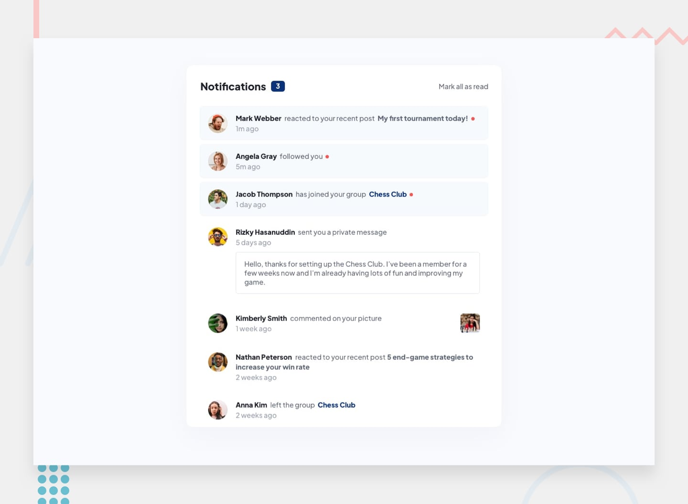

# Project Title: Notifications Page

## Table of Contents

- [Getting Started](#getting-started)
  - [Tailwind Build Command](#tailwind-build-command)
  - [Live Server](#live-server)

## Getting Started

#### Tailwind Build Command:

To build the project with Tailwind, use the following command:
`npm run watch`

#### Live Server:

To view the project in real time, launch a local development server using tools such as VS Code's Live Server extension.
